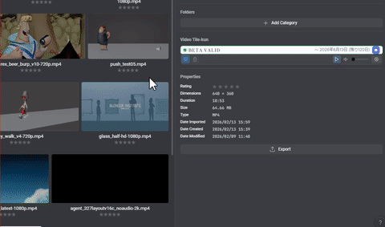
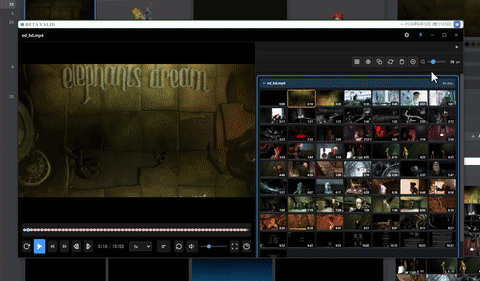

# Eagle プラグインセット（VideoTileKun）

[Eagle](https://en.eagle.cool/) 用の **VideoTileKun** 系プラグイン 3 本（VideoTileKun Inspector / VideoTileKun Player / VideoTileKun Service）をひとまとまりにした配布です。動画のタイル（サムネイル）表示・プレーヤー・自動タイル生成をサポートします。

---

## 公式ドキュメント

- **LAG 公式（詳細な使い方・FAQ）**: [VideoTileKun プラグイン — 概要・インストール・Inspector・Player・Service](https://lag-site.vercel.app/docs.html#vtk-overview)
- **このリポジトリ内**:
  - **[QUICKSTART.md](./QUICKSTART.md)** — 最短の入れ方（ダウンロード〜Eagle にインストール〜初回の流れ）
  - **[USER_GUIDE.md](./USER_GUIDE.md)** — 各プラグインの役割と基本的な使い方
  - **[CHANGELOG.md](./CHANGELOG.md)** — バージョンごとの変更内容

---

## 含まれるプラグイン

| プラグイン                | 役割                                                                           |
| ------------------------- | ------------------------------------------------------------------------------ |
| **VideoTileKunInspector** | インスペクタで動画のタイル（サムネイル）を生成・表示。ホバーでプレビュー再生。 |
| **VideoTileKunPlayer**    | 動画専用プレーヤー。タイムライン・マーカー・タイルビュー付き。                 |
| **VideoTileKunService**   | 動画をライブラリに追加したときに、バックグラウンドでタイルを自動生成。         |

3 本とも連携して使うことを想定していますが、必要なものだけ入れても動作します。

---

## ダウンロード

[Releases](https://github.com/animtools/eagle-plugin-support/releases) から最新の **VideoTileKun-plugins-vX.Y.Z.zip**（または同梱の各プラグイン zip）を取得し、Eagle のプラグインフォルダに配置してください。

**VirusTotal**: スキャン結果は各 [リリースページの説明欄](https://github.com/animtools/eagle-plugin-support/releases) に掲載しています。

※ X.Y.Z はバージョン番号です。リリースによっては「VideoTileKun-plugins」という名前の zip 1 本、またはプラグイン別の zip が含まれる場合があります。

---

## デモ・スクリーンショット

---

## 動作環境

- **Eagle** 4.0 以降
- **全プラグイン**（Inspector / Player / Service）: FFmpeg プラグイン（Eagle のプラグイン設定からインストール）が必要です。

---

## サポート

不具合報告・質問は [Issues](https://github.com/animtools/eagle-plugin-support/issues) をご利用ください。

報告時は対象プラグイン名（例: VideoTileKunInspector）を明記していただけると助かります。
